# CarShip

A modern full-stack Car Dealership Inventory Management System built using **Django REST Framework** and **React**.

CarShip enables users to browse available vehicles, search inventory, purchase vehicles, and allows administrators to efficiently manage dealership inventory through a secure dashboard.

---

## Demo Video

[](https://youtu.be/PJKjMy5G2rE)

---

## Application Screenshots

### Home Page

> 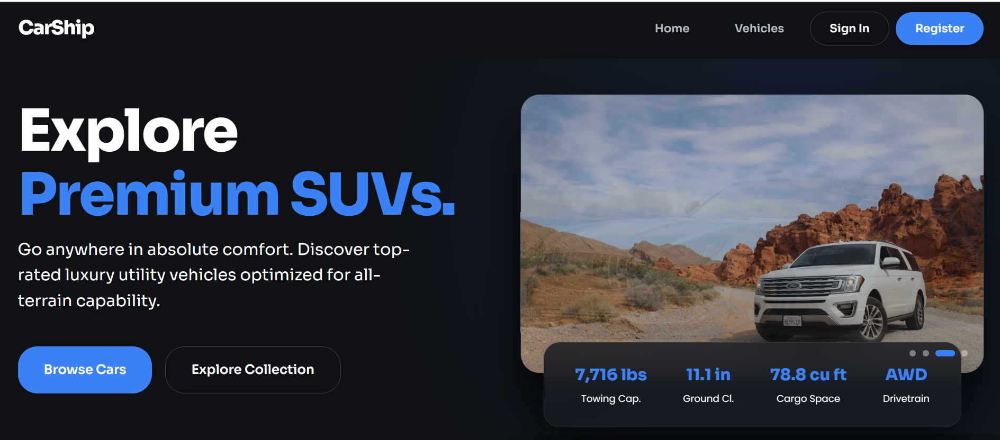

---

### Login

> 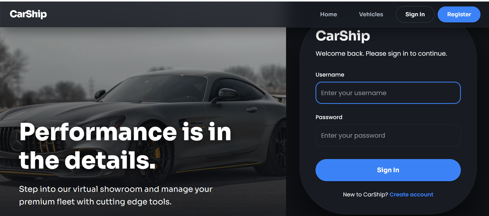

---

### Registration

> 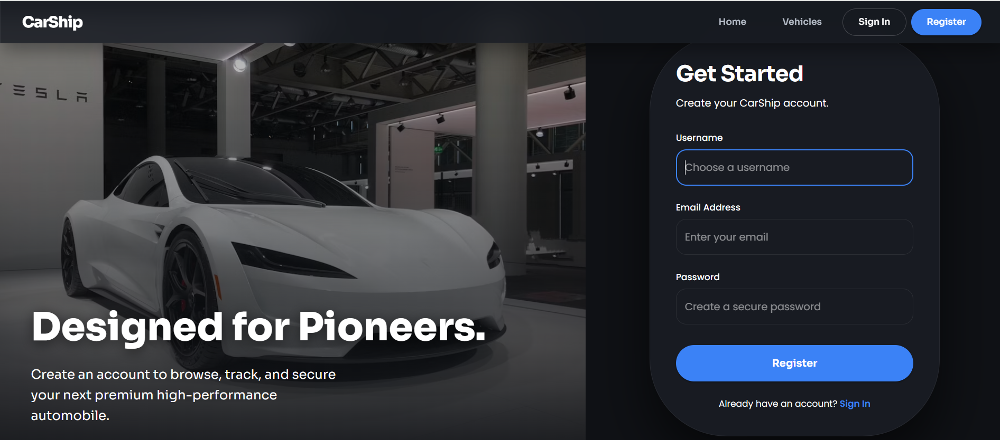

---

### Dashboard

> 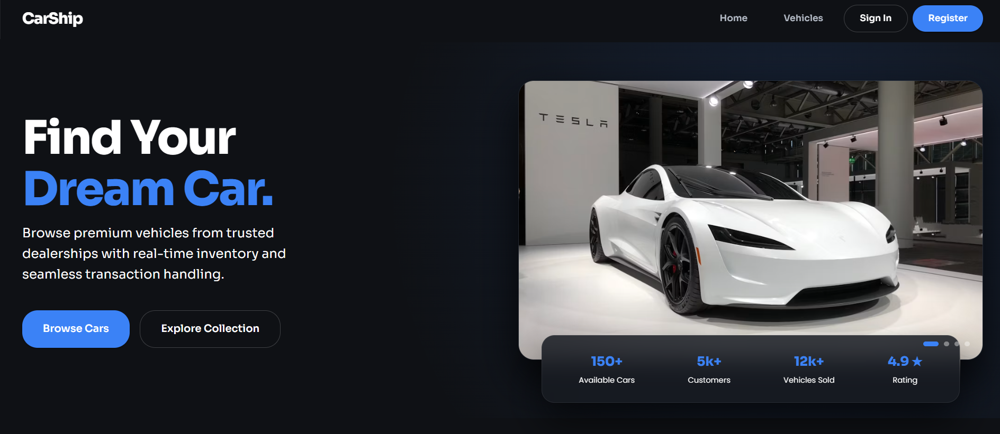

---

### Vehicle Search & Filters

> 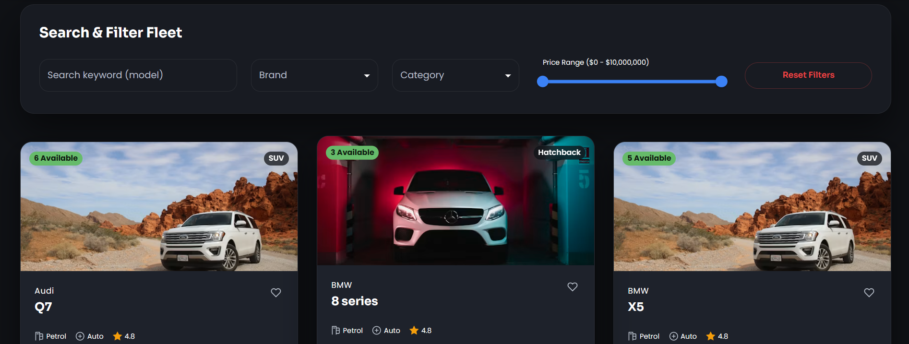
> 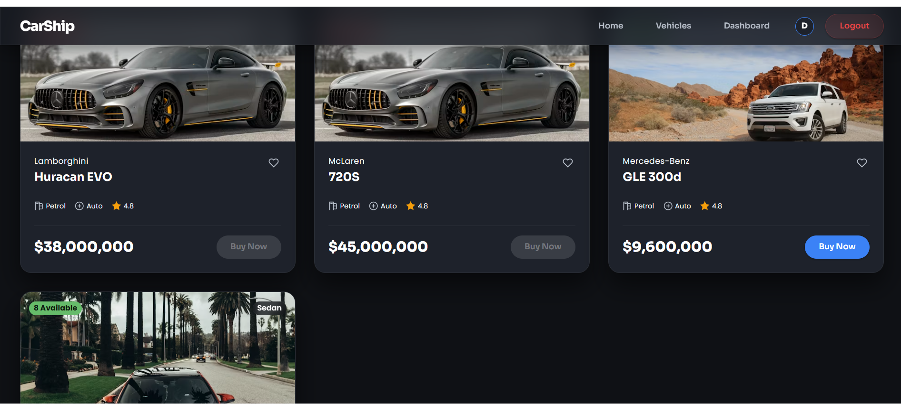

---

### Purchase Vehicle

> 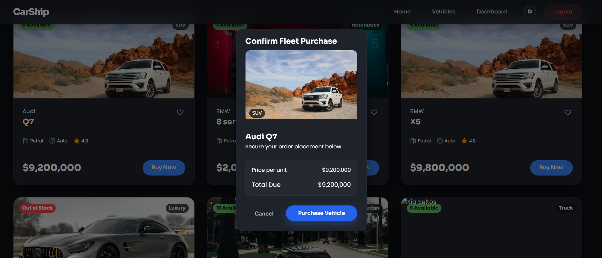
> 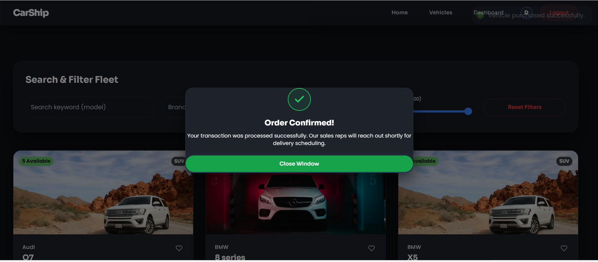
---

### Admin Dashboard

>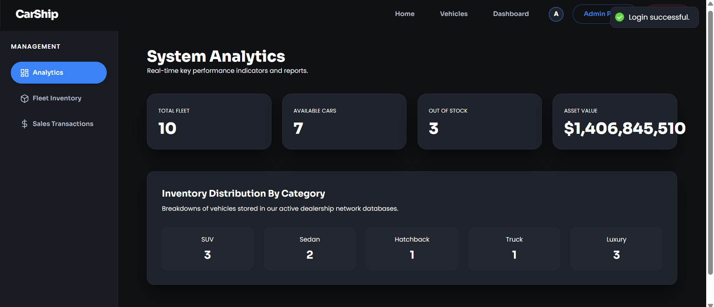
>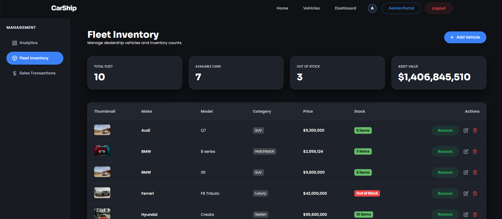
>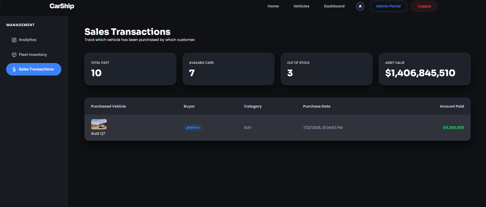
---

### Add Vehicle

> 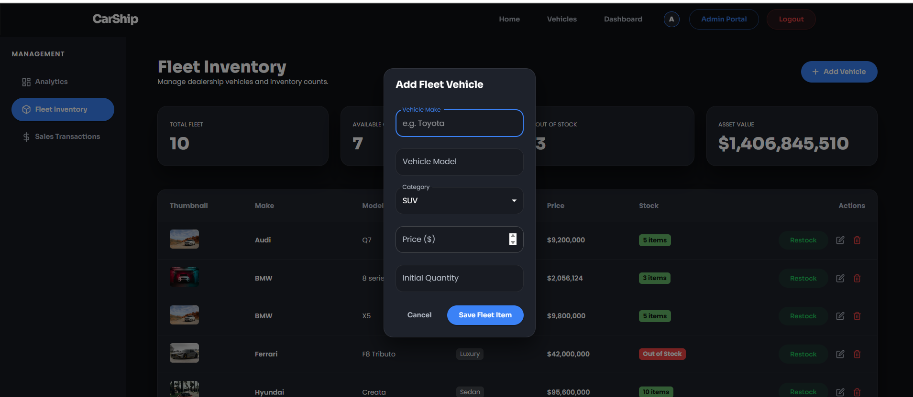
> 
---

### Update Vehicle

> 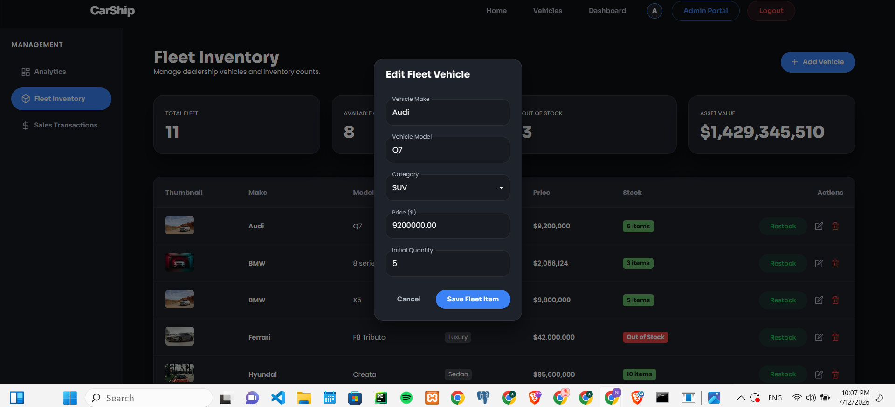

---

### Delete Vehicle

> 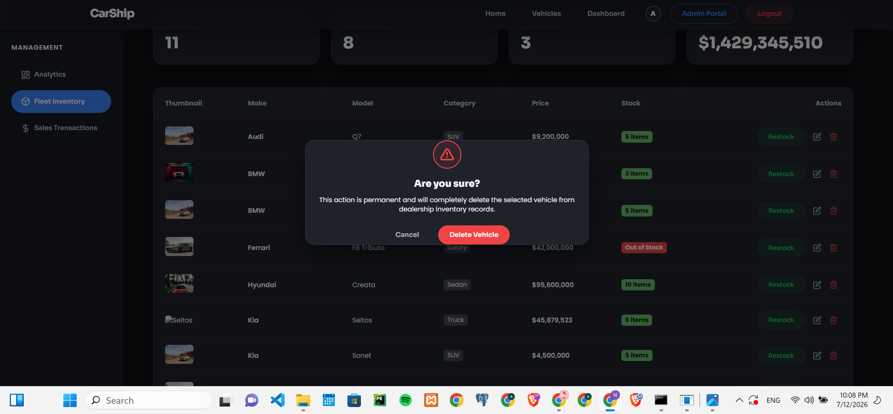

---

### Restock Vehicle

> 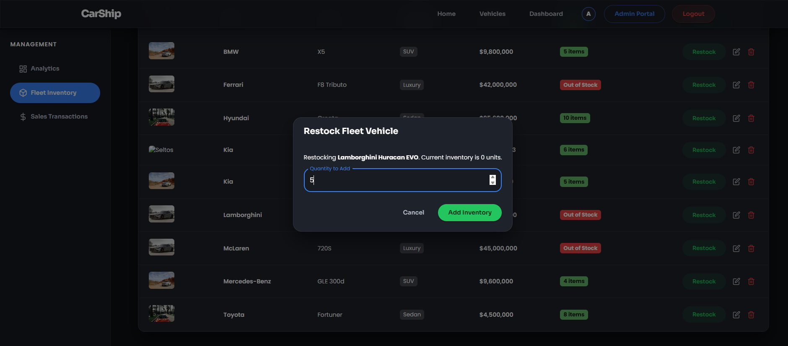

---

# Features

## Authentication & User Profiles

- **User Registration & Login**: Secured with JSON Web Tokens (JWT).
- **Profile Configuration**: Circular avatar photo crop-upload, removal actions, and display name management.
- **Dynamic Avatar Navbar Integration**: Adaptive profile initial/avatar displayed dynamically in navigation headers with instant cross-tab sync.

---


## Vehicle Management (Admin Only)

- **Create Fleet entries**: Register new vehicles in active sqlite databases.
- **Modify Models details**: Edit inventory items seamlessly.
- **Remove Vehicle records**: Soft deletion of fleet assets.

---

## Inventory & Order Management

- **Purchase Cars**: Authenticated users can buy vehicles, instantly triggering automatic database stock reductions.
- **Restock Vehicles (Admin Only)**: Replenish quantity counts.
- **Purchase Logs & Auditing**:
  - **User History**: Logged-in customers can track their own purchase transactions.
  - **Sales logs (Admin Only)**: System administrators can track full buyer accounts, amount paid, and timestamps on a detailed sales grid.

---

## Frontend

- Responsive Single Page Application (SPA).
- Luxury dark theme with glassmorphic elements and CSS transitions.
- Interactive hamburger dropdown menu drawer for smaller screens.

---

## Backend

- Django REST Framework.
- Relational database schema with service-layer architecture (separation of business logic).
- JWT (Simple JWT) authentication security.

---

# Tech Stack

### Frontend

- React & Vite
- Material UI (MUI)
- React Router
- Axios & React Context

### Backend

- Django
- Django REST Framework
- Simple JWT (Auth)
- SQLite Database

### Testing & Quality Control

- Pytest
- Coverage

### Version Control

- Git & GitHub

---

# Project Structure

```text
CarShip/

├── backend/
│   ├── apps/
│   │   ├── accounts/
│   │   └── vehicles/
│   ├── config/
│   ├── tests/
│   └── manage.py
│
├── frontend/
│   ├── src/
│   │   ├── api/
│   │   ├── components/
│   │   ├── context/
│   │   ├── pages/
│   │   ├── routes/
│   │   ├── services/
│   │   └── utils/
│   └── package.json
│
└── README.md
```

---

# API Endpoints

## Authentication

| Method | Endpoint | Description |
|---------|----------|-------------|
| POST | `/api/auth/register/` | Register a new user |
| POST | `/api/auth/login/` | Log in and receive JWT tokens |

---

## Vehicles

| Method | Endpoint | Description |
|---------|----------|-------------|
| GET | `/api/vehicles/` | List all active vehicles |
| POST | `/api/vehicles/` | Create a new vehicle (Admin only) |
| GET | `/api/vehicles/search/` | Search and filter vehicles list |
| GET | `/api/vehicles/<id>/` | View vehicle details |
| PUT | `/api/vehicles/<id>/` | Update vehicle specs (Admin only) |
| DELETE | `/api/vehicles/<id>/` | Delete vehicle from fleet (Admin only) |

---

## Inventory & Purchases

| Method | Endpoint | Description |
|---------|----------|-------------|
| POST | `/api/vehicles/<id>/purchase/` | Buy a vehicle (Decrements stock) |
| POST | `/api/vehicles/<id>/restock/` | Restock vehicle units (Admin only) |
| GET | `/api/vehicles/purchases/` | View logged-in user purchase transactions |
| GET | `/api/vehicles/purchases/all/` | View all dealership sales transactions (Admin only) |

---

# Local Setup

## 1. Clone Repository

```bash
git clone <repository-url>
cd Car-DealerShip-Inventory-System
```

---

# Backend Setup

## Create Virtual Environment

```bash
cd backend
python -m venv venv
```

Activate

Windows

```bash
venv\Scripts\activate
```

Linux / macOS

```bash
source venv/bin/activate
```

---

## Install Dependencies

```bash
pip install -r requirements.txt
```

---

## Environment Variables

Create `backend/.env` file:

```env
SECRET_KEY=your_secret_key
DEBUG=True
```

---

## Run Migrations

```bash
python manage.py migrate
```

---

## Create Superuser

```bash
python manage.py createsuperuser
```

---

## Run Backend

```bash
python manage.py runserver
```

Backend runs at `http://127.0.0.1:8000/`

---

# Frontend Setup

Go to frontend directory:

```bash
cd ../frontend
```

Install Packages

```bash
npm install
```

---

Create `frontend/.env` file:

```env
VITE_API_BASE_URL=http://127.0.0.1:8000/api
```

---

Run Dev Server

```bash
npm run dev
```

Frontend runs at `http://localhost:5173/`

---

# Running Tests

Backend Tests

```bash
pytest
```

Coverage Reports

```bash
coverage run -m pytest
coverage report
coverage html
```

---

# Design Decisions

The application follows a layered architecture to promote separation of concerns:

- **Service Layer**: Holds business logic (e.g. stocking, buying, deleting rules) separate from endpoint views.
- **Serializer Layer**: Handles schema validation and object conversion.
- **API Views Layer**: Handles request parsing, permissions, and HTTP responses.
- **Dynamic Layout Caching**: Base64 image cropping and display parameters cached in localStorage to optimize bandwidth.

---

# Future Improvements

- Payment Gateway Integration
- Email Notifications & Invoice receipts
- Wishlist & Comparison Matrix
- Docker Deployment
- PostgreSQL support in production
- CI/CD automation pipeline

---

# My AI Usage

## AI Tools Used

- ChatGPT (OpenAI)

---

## How AI Was Used

AI was used as a development assistant throughout the project.

It assisted with:

- Project planning
- API architecture discussions
- Test-Driven Development workflow
- Designing backend service structure
- Debugging implementation issues
- Frontend architecture suggestions
- README drafting


All generated suggestions were reviewed, modified where necessary, implemented manually, and tested before being committed.

---

## Reflection

Using AI significantly accelerated development by reducing boilerplate work and providing architectural guidance. It also helped identify potential edge cases during API design and testing. Every AI-generated suggestion was critically evaluated before integration to ensure correctness and maintainability.

---

# Author

**Neh Patel**

- **GitHub**: https://github.com/NEH-PATEL0810
- **LinkedIn**: https://www.linkedin.com/in/neh-patel-573a5728
- **Email**: nehp00417@gmail.com 
